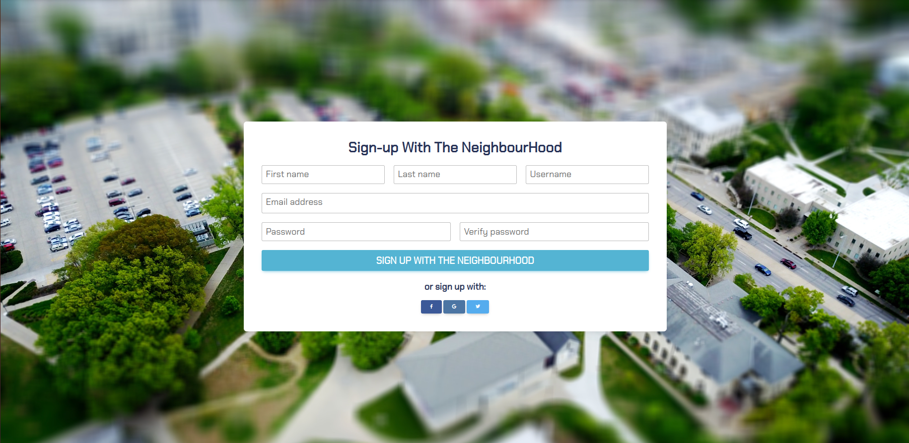
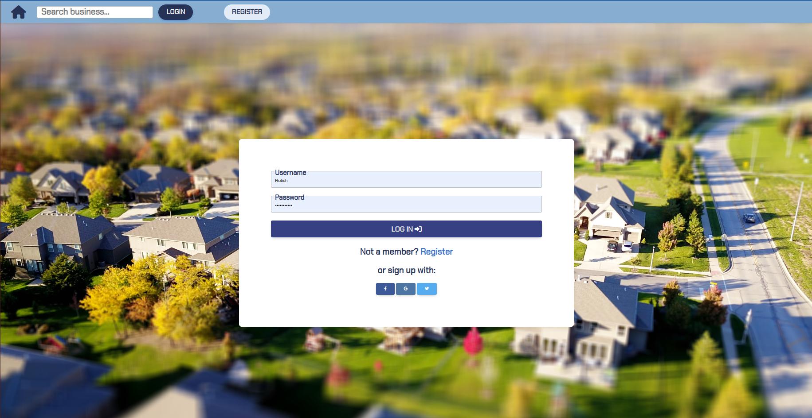
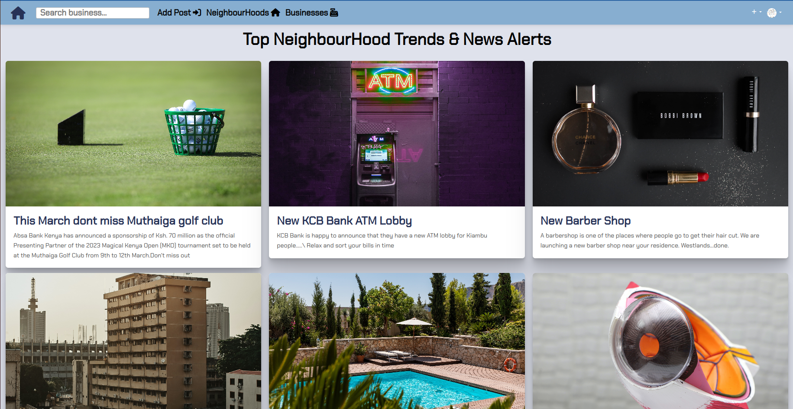
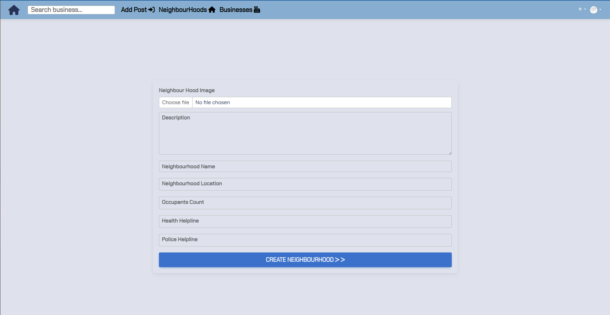

# Neighbourhood

#### By Reuben Kipkemboi

## Table of Content

+ [Description](#description)
+ [Installation Requirement](#installation-requirements)
+ [Technology Used](#technologies-used)
+ [License](#license)
+ [Authors Info](#authors-info)

## Description
You really don’t know what is happening in your neighborhood most of the time. What if an important meeting happens, theft or even death wouldn’t you like to know about it.
This is a Web application that allows you to be in the loop about everything happening in your neighborhood. From contact information of different handyman to meeting announcements or even alerts.

[Go Back to the top](#neighbourhood)


## User Stories

User Can :-

* Sign in with the application to start using.
* Set up a profile about me and a general location and my neighborhood name.
* Find a list of different businesses in my neighborhood.
* Find Contact Information for the health department and Police authorities near my neighborhood.
* Create Posts that will be visible to everyone in my neighborhood.
* Change My neighborhood when I decide to move out.
Only view details of a single neighborhood.

[Go Back to the top](#neighbourhood)

Registration



Login




Home Module



Our Neighbourhoods


Create a Neighbourhood




Create New Business in your Neighbourhood


Create a Post/Alert


## Behaviour Driven Development
| Behaviour | Input | Output |
| ---------------- | --------------- | ------------------ |
| Application starts | **On page load** | Login page for user to login |
| Registration| **Registration page** | The registration page has a register form for new users  to register to the application and are redirected to login |
| Button click | **View More click** | Upon clicking neighbourhoods navigation User can see a the available homesteads and on click of `view more` button user can see the details of a single  neighbourhood|
| Button click | **Join or Leave button** | one can decide to join a neighbourhood and also leave the neighbourhood.To leave you click on leave button and to join Join button.One can only be a member of one neighbourhood at a time|
| Profile Icon | **Profile Icon click** | User gets option to view profile, update profile and logout.On view profile user can view and also edit his or her own profile.The logout button basically ends the users session|
| Forms | **Form filling** | User gets to fill in various forms, and depending on various tasks the form are meant for, upon submission the act is done e.g for profile update on form submission users profile is updated|


## Installation Requirements

### Prerequisites

- Django
- Pip & Python
- cloudinary 
- Postgres Database
- Gunicorn

## Instructions
   
##### Clone Repository:  
 ```bash 
https://github.com/Reuben-Kipkemboi/neighbourhood.git 
```
##### Install and activate Virtual Environment virtual  
 ```bash 
cd <projectname> && python3 -m venv virtual && source virtual/bin/activate 
```  
##### Install Dependencies  
 ```bash 
 pip install -r requirements.txt 
```  
##### Setup Database  
  SetUp Database User,Password, Host then following Command  

 ```bash 
python manage.py makemigrations  
 ``` 
 Now Migrate

 ```bash 
 python manage.py migrate 
```
##### Run Application  
 ```bash 
 python3 manage.py runserver 

 or
 ./manage.py runserver
```
##### Test Application  
 ```bash 
 python manage.py test <appname>
```
Open the application on your browser `127.0.0.1:8000`.  

[Go Back to the top](#neighbourhood)


## Technologies Used


## License
[](https://opensource.org/licenses/MIT)

[MIT License](LICENSE)

## Live Site

<!-- #### https://linda-jirani.herokuapp.com/ -->


## Author's Info

 :email: [Reuben Kipkemboi](https://gmail.com)  

<p align = "center">
    &copy; 2023 @Reuben Kipkemboi.
</p>
